# PyRobotics


[](LICENSE)
[](pyproject.toml)

Intelligent vehicle autonomous driving software stack with four-layer architecture: **Perception → Decision → Control → System**. All modules decoupled via Protobuf messages with strict linear data flow.

> **Reference**: [Probabilistic Robotics (Thrun et al., 2005)](http://www.probabilistic-robotics.org/) · [arXiv:1808.10703](https://arxiv.org/abs/1808.10703)

# Table of Contents

- [What is this?](#what-is-this)
- [Requirements](#requirements)
- [How to use](#how-to-use)
- [Perception](#perception)
  - [Lane pixel detection](#lane-pixel-detection)
  - [Obstacle detection](#obstacle-detection)
  - [Obstacle tracking](#obstacle-tracking)
  - [Sign recognition](#sign-recognition)
  - [Sensor fusion](#sensor-fusion)
- [Decision](#decision)
  - [Task scheduling](#task-scheduling)
  - [Path smoothing](#path-smoothing)
  - [Obstacle avoidance](#obstacle-avoidance)
  - [Multi-agent coordination](#multi-agent-coordination)
- [Path Planning](#path-planning)
  - [A* algorithm](#a-algorithm)
  - [RRT planner](#rrt-planner)
  - [Dynamic Window Approach](#dynamic-window-approach)
- [Path Tracking](#path-tracking)
  - [Stanley control](#stanley-control)
  - [Pure Pursuit control](#pure-pursuit-control)
  - [Fuzzy control](#fuzzy-control)
  - [Model predictive control](#model-predictive-control)
  - [DQN control](#dqn-control)
  - [Controller selection](#controller-selection)
- [Localization](#localization)
  - [Extended Kalman Filter localization](#extended-kalman-filter-localization)
  - [Particle filter localization](#particle-filter-localization)
  - [Covariance Intersection fusion](#covariance-intersection-fusion)
- [SLAM](#slam)
  - [FastSLAM 2.0](#fastslam-20)
  - [Iterative Closest Point (ICP) Matching](#iterative-closest-point-icp-matching)
  - [SLAM pipeline](#slam-pipeline)
- [System](#system)
  - [Vehicle simulation](#vehicle-simulation)
  - [Real-time pipeline](#real-time-pipeline)
  - [Embedded C implementation](#embedded-c-implementation)
  - [ROS2 integration](#ros2-integration)
- [License](#license)
- [Contribution](#contribution)
- [Authors](#authors)

# What is PyRobotics?

PyRobotics implements a complete autonomous driving pipeline with multiple algorithm choices per layer:

| Layer | Algorithms | Output |
|-------|-----------|--------|
| Perception | HLS lane detection, RANSAC+DBSCAN obstacle detection (near-ground curb extraction, geometric type classification), Hungarian+Kalman obstacle tracking, HOG+NCC multi-color sign recognition (red/blue/yellow), pinhole fusion | `PerceptionOutput` |
| Decision | FSM task scheduler (PATROL→AVOID→PARK, speed smoothing + hysteresis), curvature-constrained smoothing, lateral offset avoidance | `DecisionOutput` |
| Planning | A\*, RRT+smoothing, DWA (with global path alignment) | `PlanOutput` |
| Tracking | Stanley, Pure Pursuit, Fuzzy, MPC, DQN + adaptive selector | `ControlCommand` |
| Localization | EKF (Joseph-form), Particle Filter, Covariance Intersection | `LocalizationEstimate` |
| SLAM | FastSLAM 2.0 (adaptive resampling), ICP (Huber kernel), integrated pipeline | `Map` + Pose |

**Safety-critical design**: Joseph-form covariance update, throttle/brake mutual exclusion (`if brake > 0.01: throttle = 0`), NaN guards in all estimators, covariance explosion reset.

**Minimum dependency**: NumPy, SciPy, Matplotlib, OpenCV, scikit-learn, protobuf.

Inspired by [PythonRobotics](https://github.com/AtsushiSakai/PythonRobotics).

# Requirements

**Runtime:**
- Python ≥ 3.9, NumPy, SciPy, Matplotlib, OpenCV, scikit-learn, protobuf

**Development:** pytest, grpcio-tools, ruff, mypy

# How to use

```bash
git clone https://github.com/Kat-yuan-eng/PyRobotics.git
cd PyRobotics

# Option A: pip
pip install -r requirements/requirements.txt

# Option B: conda (recommended)
conda env create -f environment.yml
conda activate pyrobotics

# Run any module standalone
python PathTracking/stanley_controller.py

# Closed-loop simulation
python main_loop.py
```

Regenerate Protobuf: `python -m grpc_tools.protoc -I=proto --python_out=generated proto/*.proto`

---

# Perception

## Lane pixel detection

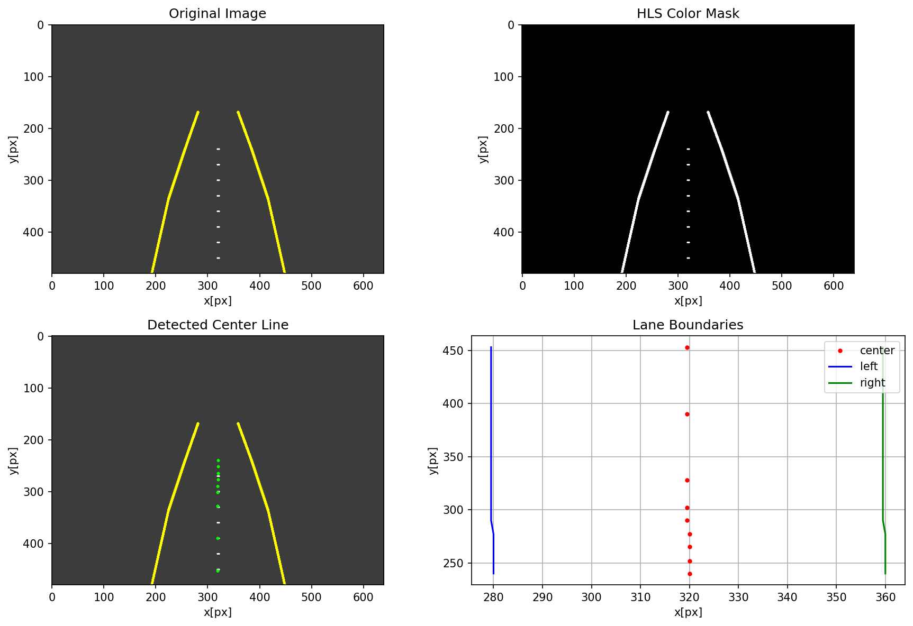

Extracts lane center line and boundary points from camera images via **HLS color space conversion → scan-line peak detection with jump filter**. The jump filter rejects isolated noise pixels by enforcing minimum peak width and height thresholds. Outputs pixel coordinates of left/right boundaries and center line for downstream path planning.

## Obstacle detection

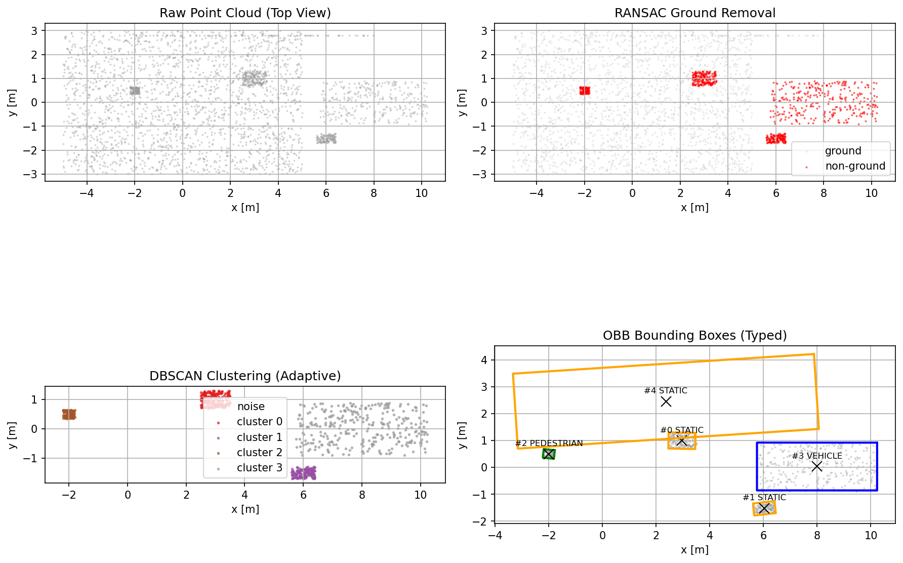

Processes 3D LiDAR point clouds through a **RANSAC ground plane removal → voxel downsampling → DBSCAN clustering → OBB fitting** pipeline with **near-ground obstacle extraction** and **geometric type classification**. Near-ground points (e.g., curbs at z=0.05-0.12m) missed by RANSAC are recovered by a secondary pass over ground-plane points within 0.03-0.2m elevation. Each obstacle is classified by height, area, and aspect ratio into VEHICLE, PEDESTRIAN, CYCLIST, or STATIC. Distance-adaptive DBSCAN automatically adjusts eps and min_pts for far-range sparse point clouds. Deterministic RANSAC via seeded RNG ensures reproducible results.

## Obstacle tracking

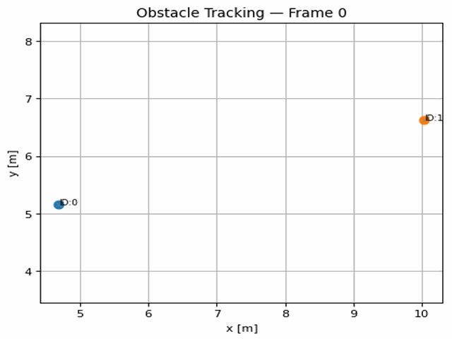

Maintains consistent track IDs across frames using **Hungarian algorithm (scipy linear_sum_assignment)** for optimal data association combined with **2D constant-velocity Kalman filter** for state estimation. The Kalman filter state [x, y, vx, vy] provides smooth position prediction and velocity estimation from position history. Handles track creation (new detections unmatched), persistence (matched with predicted position), and deletion (lost for N consecutive frames). Confirmed tracks get extended occlusion tolerance (max_age=15 vs 5 for unconfirmed) with occlusion flag. Free ID pool recycles deleted track IDs to prevent overflow. Fully integrated into main_loop pipeline: detection → tracking → fusion.

## Sign recognition

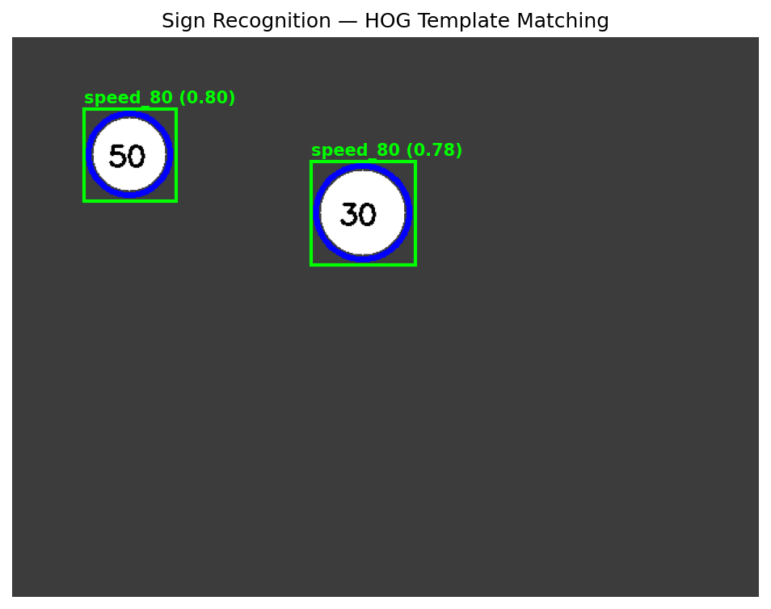

Detects and classifies traffic signs from camera images using **multi-color HSV segmentation** (red for speed/prohibition, blue for mandatory, yellow for warning) combined with **shape pre-classification** (circle, triangle, rectangle) and **HOG+NCC template matching** at 128×128 resolution. Shape pre-classification reduces the template search space — circular signs match only speed/mandatory/prohibition templates, triangles match only warning templates. Speed limit signs are further refined by **ROI normalized cross-correlation** on the inner digit region to distinguish similar numbers (e.g., 30 vs 50). Supports 24 rotation angles (15° increments) with data augmentation (noise, blur, brightness, shift) for robustness. NMS post-processing eliminates duplicate detections.

## Sensor fusion

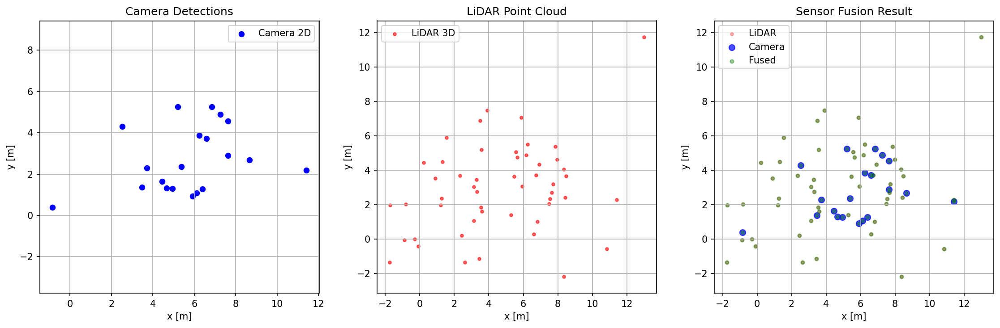

Fuses camera detections and LiDAR obstacles into a unified coordinate frame using **pinhole camera model back-projection**. Transforms 2D pixel detections to 3D vehicle coordinates via camera intrinsic/extrinsic matrices, then merges with LiDAR obstacles by spatial proximity. Outputs a single `PerceptionOutput` message consumed by the decision layer.

# Decision

## Task scheduling

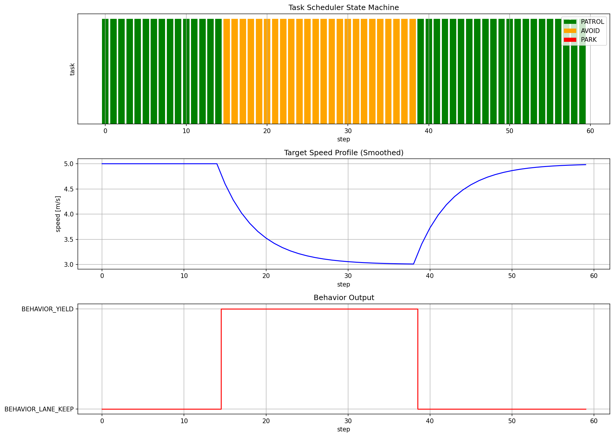

Finite state machine orchestrating three operational modes: **PATROL → AVOID → PARK**. State transitions are triggered by perception events — obstacle proximity triggers PATROL→AVOID, parking sign triggers PARK, obstacle clearance returns to PATROL. Each state generates appropriate target path, speed profile, and behavior flag for the control layer. The visualization shows a full cycle: patrol (green) until an obstacle appears at step 15, avoid (orange) while maneuvering around it, then return to patrol after clearance at step 36.

## Path smoothing

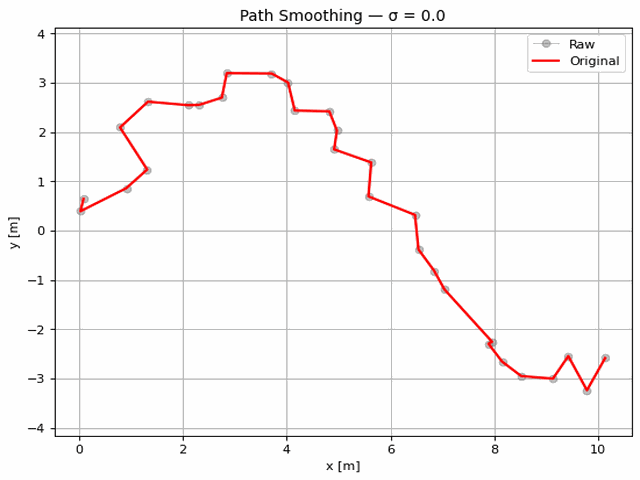

Refines piecewise-linear paths into **curvature-constrained smooth trajectories** via iterative shortening with deviation bounds. Ensures the smoothed path never deviates beyond `max_deviation` from the original waypoints while producing continuous curvature profiles suitable for downstream controllers. Uses gradient descent on path length minimization subject to curvature ≤ κ_max constraints.

## Obstacle avoidance

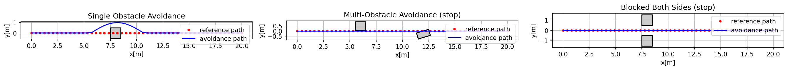

Generates **lateral offset bypass paths** around detected obstacles by shifting the reference trajectory left or right of each obstacle's safety envelope. Computes safe offset magnitude from obstacle dimensions plus configurable margin. Produces three candidate paths (left-shift, right-shift, original) for the controller selector to choose from based on feasibility.

## Multi-agent coordination

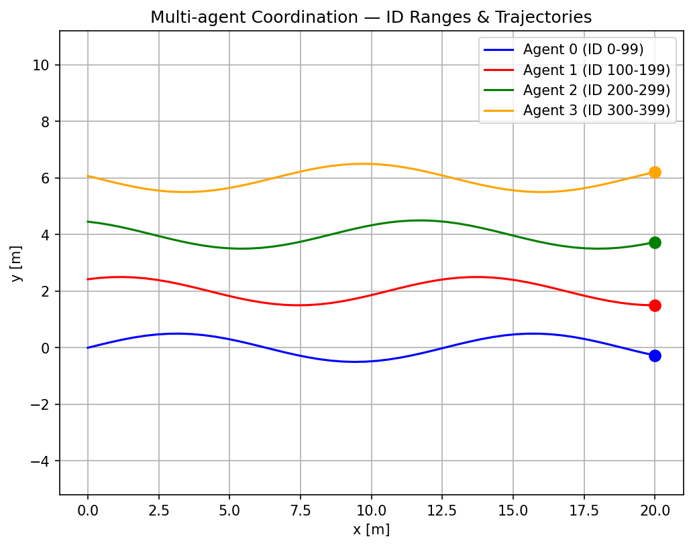

Coordinates multiple vehicles sharing the same road segment via **ID-offset assignment** (each agent gets unique ID range) and **velocity validation** (rejects speed/timestamp outliers). Prevents ID collisions between agents and ensures temporal consistency of shared state messages.

# Path Planning

## A* algorithm

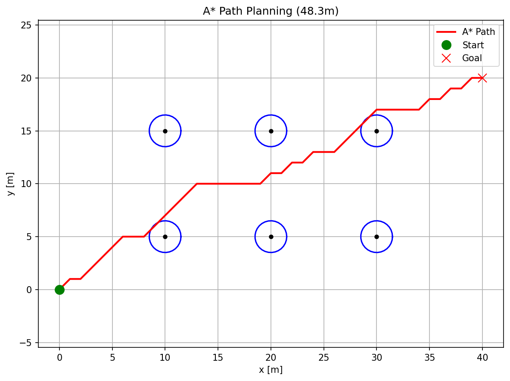

Grid-based optimal path search using **A\*** heuristic (Euclidean distance). Explores nodes ordered by f(n) = g(n) + h(n) where g is cost-from-start and h is estimated-cost-to-goal. Returns the shortest collision-free path through a discretized occupancy grid. Resolution and robot radius are configurable parameters controlling plan quality vs computation time.

Reference: [Wikipedia](https://en.wikipedia.org/wiki/A*_search_algorithm)

## RRT planner

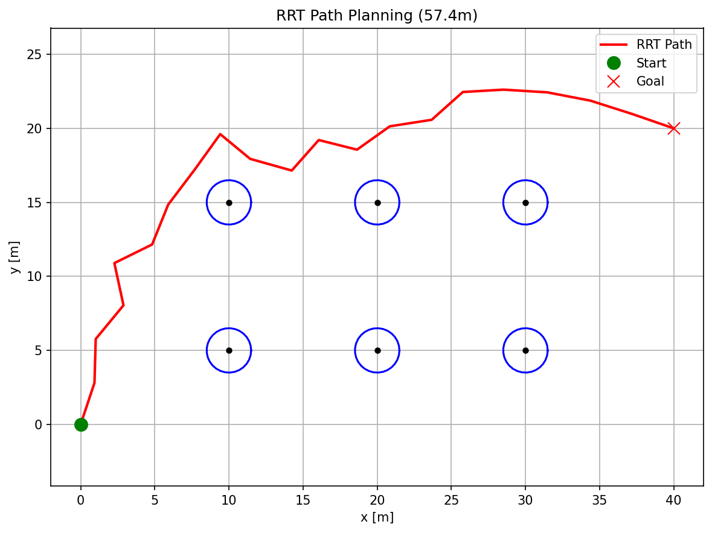

Sampling-based planner using **Rapidly-exploring Random Trees (RRT)** with integrated path smoothing. Grows a tree from start toward randomly sampled goals, connecting to the nearest node when collision-free. The raw tree path is post-processed with shortcutting and spline smoothing to produce a drivable trajectory. Handles non-convex obstacle configurations that grid-based methods struggle with.

Reference: [Wikipedia](https://en.wikipedia.org/wiki/Rapidly-exploring_random_tree)

## Dynamic Window Approach

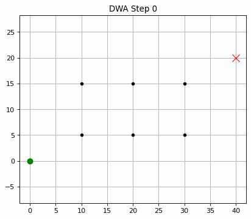

Local planner evaluating **admissible velocity pairs (v, ω)** within the dynamic window defined by kinematic limits and acceleration constraints. Scores each candidate on heading error, obstacle clearance, velocity progress, and **global path alignment cost** (penalizes deviation from the global reference path). Selects the highest-scoring velocity command for the next control cycle.

Reference: [Fox et al., 1997](https://www.ri.cmu.edu/pub_files/pub1/fox_dieter_1997_1/fox_dieter_1997_1.pdf)

# Path Tracking

## Stanley control

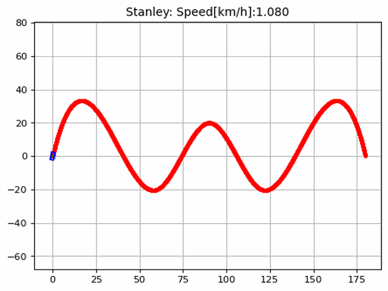

Geometric steering law computing **cross-track error feedback at the front axle**: δ = θ_e + arctan(k·e / v). The heading error term (θ_e) aligns the vehicle orientation with the path tangent; the cross-track term (e/v) provides proportional correction scaled inversely with speed for stability at low speeds. Combined with PID longitudinal control for speed tracking. Proven on Stanford's DARPA Grand Challenge winner.

Reference: [Thrun et al., 2006](http://robots.stanford.edu/papers/thrun.stanley05.pdf) · [Snider, 2009](https://www.ri.cmu.edu/pub_files/2009/2/Automatic_Steering_Methods_for_Autonomous_Automobile_Path_Tracking.pdf)

## Pure Pursuit control


Lookahead-based geometric tracker selecting a **goal point on the reference path at distance L_d ahead** of the vehicle, then computing steering to drive toward that point. Lookahead distance is typically proportional to speed (L_d = k·v) for natural corner-cutting behavior at higher speeds. Simple, robust, and widely used as a baseline controller.

Reference: [Coulter, 1992](https://www.ri.cmu.edu/pub_files/pub3/coulter_r_craig_1992_1/coulter_r_craig_1992_1.pdf)

## Fuzzy control

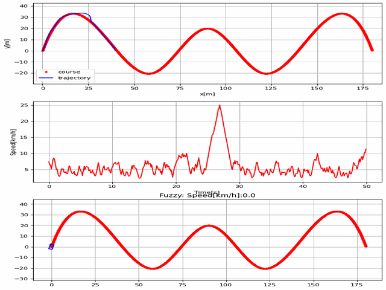

**Curvature-adaptive fuzzy logic controller** taking road curvature (κ) and speed deviation (Δv) as inputs. Uses 3 membership functions for curvature (straight/gentle/sharp) and 5 for speed deviation (large_neg/neg/zero/pos/large_pos) with complete overlap to eliminate boundary dead zones. A 3×5 rule base maps input combinations to steering angle and throttle output. Excels in low-speed, high-curvature scenarios where model-based controllers struggle.

## Model predictive control

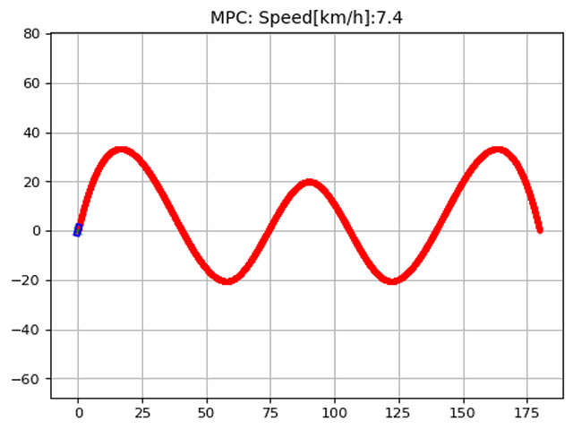

Optimal control solving a **constrained optimization over a receding horizon**. Linearizes the bicycle model around the current state at each timestep, then minimizes a quadratic cost function penalizing cross-track error, heading error, steering effort, and terminal state deviation. Explicitly handles steering rate and acceleration constraints. Iterative linear MPC with warm-start from previous solution for real-time performance.

Reference: [Graichen, 2017](http://grauonline.de/wordpress/?page_id=3244)

## DQN control

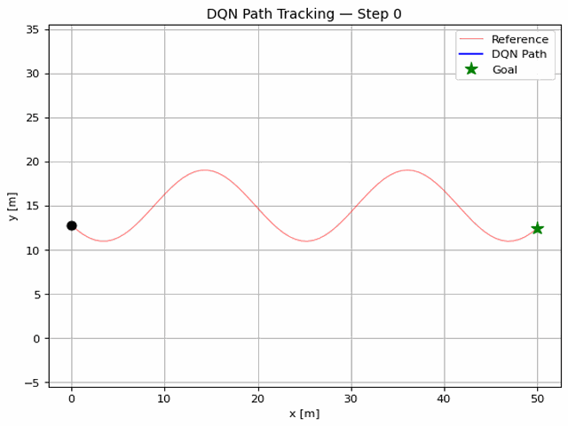

Reinforcement learning-based controller training a **Deep Q-Network** to map state observations (16-beam path scans, speed, heading, lateral error, heading error, curvature, goal distance, goal direction) to discrete steering and throttle actions. Implements **Double DQN** (online network selects actions, target network evaluates Q-values) to reduce overestimation bias. Uses **curvature-adaptive action space** — fine-grained steering (±2°, ±5°, ±10°) near the goal for precision, coarser steering (±7°, ±13°, ±20°) elsewhere for efficiency. Training reward includes progressive goal proximity bonus within 3m and speed penalty above 10 m/s.

## Controller selection

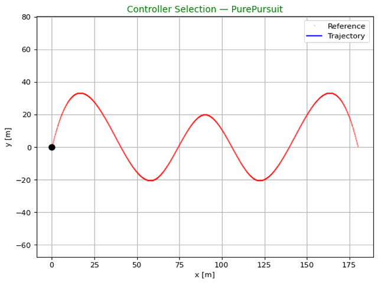

Adaptive switching logic choosing among Stanley, Pure Pursuit, Fuzzy, MPC, and DQN based on **path curvature and vehicle speed**. Curvature-adaptive selection: κ>0.15 → MPC (extreme curves), κ>0.03 → Pure Pursuit (best curve accuracy, RMS 0.15m), high speed → Pure Pursuit (stability), low speed → Stanley (stable startup), near goal → Stanley (precise arrival). Implements **Bumpless Transfer** by passing the previous steering angle as initial condition to the newly activated controller, preventing discontinuous steering jumps during handoff.

# Localization

## Extended Kalman Filter localization

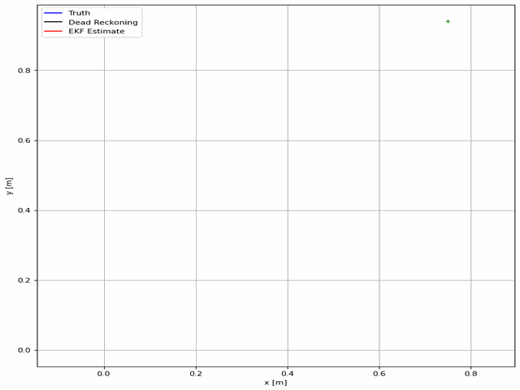

Sensor fusion estimator combining **wheel odometry prediction** with **GPS/IMU observation updates** via first-order Taylor linearization. Uses **Joseph-form covariance update** (P = (I-KH)·P_pre·(I-KH)^T + K·R·K^T) which guarantees positive semi-definiteness even under numerical errors. Includes covariance explosion detection — resets P matrix when max(diag(P)) > 100 to prevent filter divergence from bad observations.

Reference: [Probabilistic Robotics, Ch. 7](http://www.probabilistic-robotics.org/)

## Particle filter localization

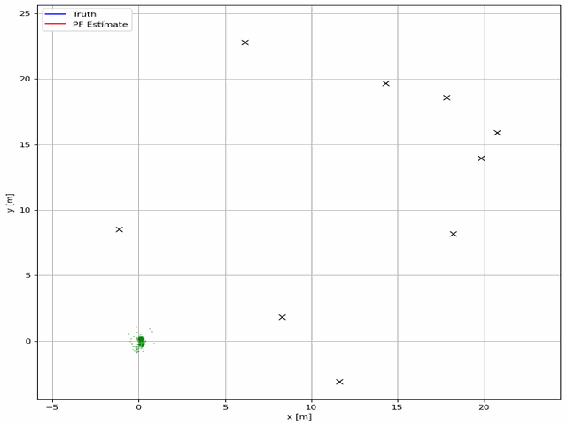

Monte Carlo localization maintaining **N particles representing pose hypotheses**, weighted by observation likelihood. Prediction step propagates particles through motion model; update step reweights by sensor measurement probability. Uses **systematic resampling** to prevent particle degeneracy, with NaN-safe weight normalization to handle zero-likelihood edge cases. Visualization shows particle cloud converging toward ground truth over time.

Reference: [Probabilistic Robotics, Ch. 8](http://www.probabilistic-robotics.org/)

## Covariance Intersection fusion

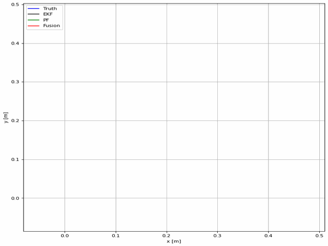

Combines EKF and PF estimates into a **consistent fused estimate without requiring cross-correlation knowledge**. CI finds optimal convex combination weights (ω, 1-ω) minimizing the trace of fused covariance: P_fuse = ω·P_EKF + (1-ω)·PF_PF. Includes divergence detection — if one estimator's innovation exceeds 3σ threshold for consecutive steps, falls back to the more consistent estimator alone.

# SLAM

## FastSLAM 2.0

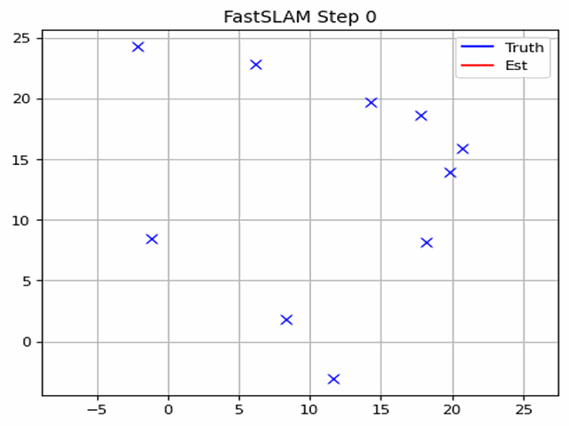

Particle-based SLAM where **each particle carries its own EKF-based landmark map**. Landmark initialization uses a minimum-distance gate; data association solves via nearest-neighbor with Mahalanobis distance chi-squared test. Features **Joseph-form landmark update** (same numerical robustness as localization EKF) and **adaptive resampling threshold** based on EMA of effective sample size N_eff — resamples only when particle diversity drops below threshold, avoiding unnecessary computation.

Reference: [Probabilistic Robotics, Ch. 13](http://www.probabilistic-robotics.org/) · [Bailey & Durrant-Whyte](http://www-personal.acfr.usyd.edu.au/tbailey/software/slam_simulations.htm)

## ICP matching

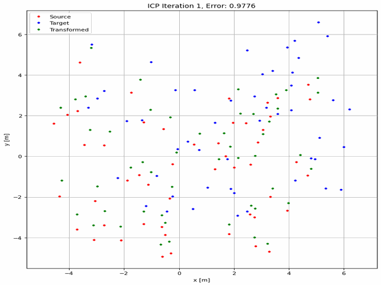

Point cloud registration finding the **optimal rigid transformation (R, t)** aligning source points to target via iterative closest point correspondence. Each iteration: (1) find nearest neighbors, (2) compute SVD-based optimal transform, (3) apply transform, (4) check convergence. Supports **initial pose guess** for faster convergence and **Huber robust kernel** to downweight outlier correspondences. Terminates when translation change < ε_t or rotation change < ε_r.

Reference: [Besl & McKay, 1992](https://cs.gmu.edu/~kosecka/cs685/cs685-icp.pdf)

## SLAM pipeline

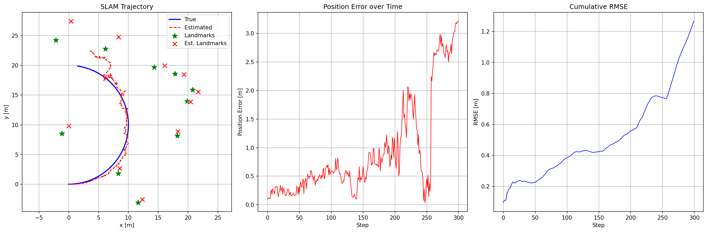

Integrated SLAM system running **EKF for real-time pose estimation** (fast, low-latency) and **FastSLAM 2.0 for background map building** (accurate, handles loop closure). Periodically runs ICP refinement to correct drift accumulation. Outputs pose estimate, landmark map, and per-step RMSE metrics for validation.

# System

## Vehicle simulation

Bicycle kinematic model providing **state feedback (x, y, yaw, v) for closed-loop control**. Supports front-wheel steering geometry with wheelbase-dependent turning radius. Configurable initial pose, speed limits, and simulation timestep. Used as the plant in all tracking controller tests.

## Real-time pipeline

Dual-thread architecture implementing the perception-control timing requirements: **perception thread at 30ms period** (image processing, obstacle detection) and **control thread at 50Hz** (state estimation, path tracking). Inter-thread communication via thread-safe `LatestResult` containers ensuring the consumer always reads the most recent producer output without blocking.

## Embedded C implementation

Production-ready C code for resource-constrained microcontrollers using **Q16.16 fixed-point arithmetic** throughout:

| Module | Key Features |
|--------|-------------|
| PID | Anti-windup clamping, jerk limiting via rate-limited output |
| Stanley | Front-axle cross-track error with fixed-point atan2 approximation |
| EKF | Joseph-form update, FP_CLIP overflow protection on every multiply |
| Vehicle | Inner-loop (steering) + outer-loop (speed) cascaded PID |

All fixed-point operations include `FP_CLIP()` macro to saturate results within [-32768, 32767] range, preventing integer overflow without branching.

## ROS2 integration

Three-node ROS2 package demonstrating production deployment:

- **Perception node**: subscribes to `/camera/image_raw` and `/lidar/points`, publishes `PerceptionOutput`
- **Planning node**: uses `ApproximateTimeSynchronizer` to align multi-topic perception data before planning
- **Control node**: subscribes to planned path, publishes `/vehicle/cmd_vel` (twist) and `/vehicle/steering_cmd`

Includes custom message definitions in `smart_car_interfaces/` package.

# License

MIT

# Contribution

Welcome! See [CONTRIBUTING.md](CONTRIBUTING.md) for guidelines.

# Authors

- [PyRobotics Contributors](https://github.com/Kat-yuan-eng/PyRobotics/graphs/contributors)
- Inspired by [PythonRobotics](https://github.com/AtsushiSakai/PythonRobotics) by Atsushi Sakai

# Citing

If you use PyRobotics in your research, please cite:

```bibtex
@misc{pyrobotics2025,
  title={PyRobotics: Intelligent Vehicle Autonomous Driving Software Stack},
  author={Kat-yuan-eng},
  year={2025},
  url={https://github.com/Kat-yuan-eng/PyRobotics}
}

@book{probabilistic_robotics_2005,
  title={Probabilistic Robotics},
  author={Sebastian Thrun and Wolfram Burgard and Dieter Fox},
  year={2005},
  publisher={MIT Press}
}
```
